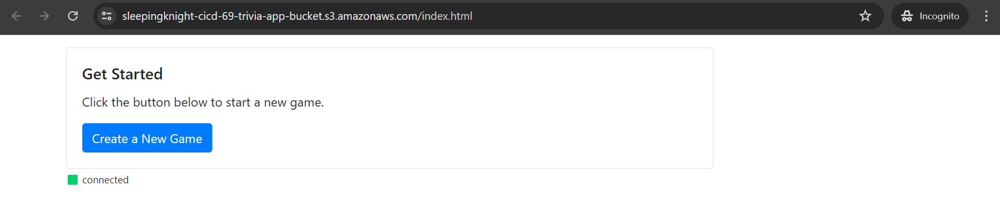

**NOTE:** Currently API Gateway Web Socket is not supported in Jakarta Region, please use N. Virginia Region


# Part 1: Install SAM CLI
You can refer this [documentation](https://docs.aws.amazon.com/serverless-application-model/latest/developerguide/install-sam-cli.html) to install SAM CLI based on your OS
```shell
wget https://github.com/aws/aws-sam-cli/releases/latest/download/aws-sam-cli-linux-x86_64.zip

unzip aws-sam-cli-linux-x86_64.zip -d sam-installation

sudo ./sam-installation/install

sam --version
```


# Part 2: Deploy Backend Infra
**Step 1:** Change directory to **cicd-implementation-labs** folder and use AWS SAM to build **template.yaml** file.
```shell
cd cicd-implementation-labs/
sam build
sam deploy --guided
```


**Step 2:** 
Then, you will be presented with the AWS SAM deploy configuration. For *Stack Name*, type **trivia-app**. For other configurations, leave the default by pressing **Enter**.


**Step 3:** Still in the terminal, pay attention to the *Outputs* table. Copy the **Value** from the API Gateway websockets endpoint. The values ​​will look like this:
```shell
wss://xxxxxxxxxx.execute-api.us-east-1.amazonaws.com/Prod
```


# Part 3: Testing the Frontend
**Step 1:** Please open the file *cicd-implementation-labs/front-end-react/src/config.js* (you can use the toggletree alias Explorer on the left), then update the *WebsocketEndpoint* value with the endpoint you copied earlier. If so, make sure you save the file by pressing the CTRL+S combination.
```shell
module.exports = {
  WebsocketEndpoint: 'wss://xxxxxxxxxx.execute-api.ap-southeast-1.amazonaws.com/Prod'
};
```

**Step 2:** Back in the your terminal, set the Node version to v16 (codename: Gallium).
```shell
nvm install lts/gallium
nvm alias default lts/gallium
```

**Step 3:** Move to the front-end-react folder, install NPM dependencies, then run Trivia App.
```shell
cd front-end-react/
npm install
npm run start
```

**Note:** There is currently an issue with webpack dependencies with Node v17 version. If you see an error like this: 'ERR_OSSL_EVP_UNSUPPORTED', make sure to run the application with Node v16 version.

**Step 4:** After the NPM dependencies installation is complete, you may see NPM warnings. Don't worry, don't worry about it for now. You can continue to the next step.

**Step 5:** You will see the Trivia App running. Please try Trivia App to your heart's content.


If you deploy on server, you can also see on the browser


# Part 4: Deploy Frontend to S3 Bucket
**Step 1:** First, create an S3 bucket with a unique name. Here we have created terraform code to run an S3 static website. What you need to do is create a *terraform.tfvars* file in the **/terraform/environment/01_prod** directory
```terraform.tfvars
account_id  = "<YOUR-AWS-ACCOUNT-ID>"
aws_profile = "<YOUR-AWS-CLI-PROFILE>"
environment = "<ARBITARY-ENVIRONMENT>"

s3_bucket_details = {
  "trivia-app" = {
    bucket_name = "<YOUR-UNIQUE-BUCKET-NAME>"
    source_ip   = "<YOUR-PUBLIC-IP-ADDRESS>"
  }
}
```

**Step 2:** Run these terraform command, to provision AWS resources (Make sure, you are in **/terraform/environment/01_prod** directory)
```shell
terraform init
terraform apply
```

**Step 3:** After that, carry out the build process for the Trivia App by running the following command
```
npm run build
```

**Note:** After the build process, a folder called **build** appears which contains all the resources that have been optimized and can be deployed.


**Step 4:** After the build process is complete, now is the time for us to deploy the frontend to the S3 bucket. The deploy process is actually copying all the contents of the build folder to the S3 bucket that we just created.


Great, the frontend has been successfully *deployed*. You can access the Trivia App application via the following URL: **https://{{YOUR-BUCKET-NAME}}/index.html**


